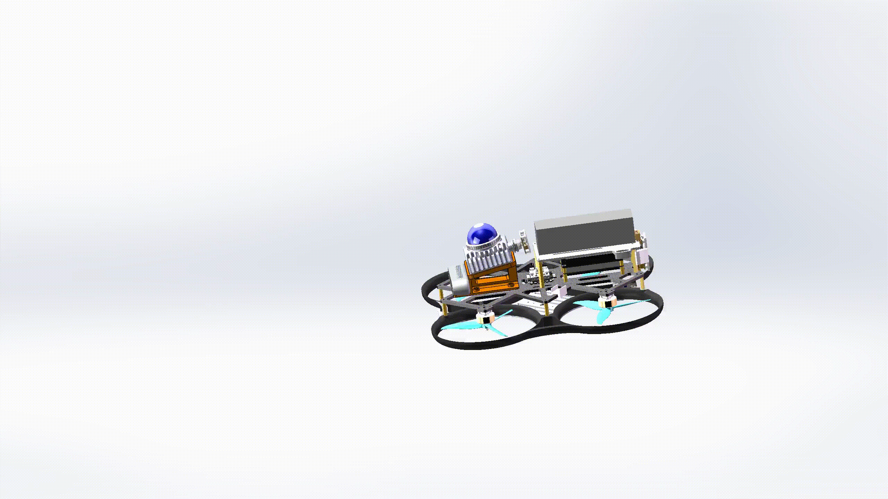

<!-- GitHub Profile README — XinJie Zhang -->

  <a href="./README.md">简体中文</a>

  

   

  <h1>XinJie Zhang</h1>
  <h3>Mechanical Engineering</h3>

  

    <code>SLAM</code>&nbsp;&nbsp;·&nbsp;&nbsp;
    <code>Autonomous UAV Systems</code>&nbsp;&nbsp;·&nbsp;&nbsp;
    <code>Embedded Systems</code>
  

  
<strong>Building complete robotic systems from algorithm research to real-world deployment.</strong>

  

    Algorithm Development&nbsp;&nbsp;·&nbsp;&nbsp;Software Architecture&nbsp;&nbsp;·&nbsp;&nbsp;
    Simulation&nbsp;&nbsp;·&nbsp;&nbsp;Hardware Integration&nbsp;&nbsp;·&nbsp;&nbsp;Real-World Deployment
  

 

## Core Expertise

<table>
  <tr>
    <td width="33.33%" valign="top">
      

        
      

      <h2>🛰️ SLAM</h2>
      
<strong>LiDAR–IMU–Vision Fusion SLAM Framework</strong>

      
Independent development of core modules for localization, mapping, and multi-sensor fusion

      <ul>
        <li>LiDAR–inertial odometry</li>
        <li>Iterated Error-State Kalman Filter (IESKF)</li>
        <li>Incremental mapping and map management</li>
        <li>Stereo vision fusion and multi-sensor calibration</li>
      </ul>
      
Engineering: ROS 2 · C++ · LiDAR / IMU / Vision

    </td>
    <td width="33.33%" valign="top">
      

        
      

      <h2>🚁 UAV Systems</h2>
      
<strong>PX4–ROS 2 Autonomous UAV Systems</strong>

      
Independent airframe and propeller guard design, onboard hardware integration, and full-system commissioning

      <ul>
        <li>UAV airframe and propeller guard design</li>
        <li>Flight controller, onboard computer, and sensor integration</li>
        <li>PX4–ROS 2 communication and MAVLink control</li>
        <li>Gazebo simulation and real-world flight validation</li>
      </ul>
      
Engineering: Custom Airframe · PX4 · ROS 2 · Gazebo

    </td>
    <td width="33.33%" valign="top">
      

        
      

      <h2>🔧 Embedded Systems</h2>
      
<strong>STM32 Embedded Robotic Control Systems</strong>

      
Independent controller design and system integration across hardware, firmware, and device communication

      <ul>
        <li>Main controller and peripheral circuit design</li>
        <li>PCB design, soldering, and hardware debugging</li>
        <li>Sensor drivers and data acquisition</li>
        <li>CAN / UART / SPI / I2C communication interfaces</li>
      </ul>
      
Engineering: STM32 · PCB · CAN / UART / SPI / I2C

    </td>
  </tr>
</table>

 

## Engineering Projects

<table>
  <tr>
    <td width="50%" valign="top">
      
      <h3>
        <a href="https://github.com/legededaduzi/mini-livo">🔥 Mini-LIVO ↗</a>
      </h3>
      
A lightweight LiDAR–inertial odometry framework built on ROS 2.

      

        <strong>Real-Time SLAM</strong> · IESKF Backend 
        ikd-Tree Incremental Mapping · MID360 Support 
        D435 Stereo Vision · UAV Deployment
      

      
<a href="https://github.com/legededaduzi/mini-livo"><strong>View System →</strong></a>

    </td>
    <td width="50%" valign="top">
      
      <h3>
        <a href="https://github.com/legededaduzi/PX4-AeroFusion-Sim">🌎 PX4 AeroFusion Simulation Platform ↗</a>
      </h3>
      
A complete robotics simulation environment for autonomous system validation.

      

        <strong>PX4 UAV Simulation</strong> · Livox MID360 Model 
        RealSense D435 Model · Indoor / Tunnel Environments 
        Reproducible SLAM Evaluation
      

      
<a href="https://github.com/legededaduzi/PX4-AeroFusion-Sim"><strong>View Simulation Platform →</strong></a>

    </td>
  </tr>
  <tr>
    <td width="50%" valign="top">
      
      <h3><a href="https://github.com/legededaduzi/5inch-slam-UAV">🚁 5.5-inch SLAM UAV ↗</a></h3>
      
A compact autonomous UAV platform for indoor inspection, confined-space exploration, and SLAM validation.

      

        <strong>Custom Carbon-Fiber Airframe</strong> · PX4 Flight Control 
        Livox MID-360 · RealSense D435i 
        Jetson Orin NX · PETG-CF Propeller Guards
      

      
<a href="https://github.com/legededaduzi/5inch-slam-UAV"><strong>View UAV Project →</strong></a>

    </td>
    <td width="50%" valign="top">
      
      <h3><a href="https://github.com/legededaduzi/3dgs-with--LIVO">✨ 3DGS with LIVO ↗</a></h3>
      
A ROS 2 online dense mapping system combining stereo RGB-D, odometry, and 3D Gaussian Splatting.

      

        <strong>Online Gaussian Mapping</strong> · Stereo RGB-D Synchronization 
        Keyframe Selection · Gaussian Densification and Optimization 
        Real-Time Rendering Preview · PLY Map Export
      

      
<a href="https://github.com/legededaduzi/3dgs-with--LIVO"><strong>View Mapping System →</strong></a>

    </td>
  </tr>
</table>

 

## Tech Stack

<table>
  <tr>
    <td width="25%" valign="top">
      <h4>Robotics</h4>
      <code>ROS2</code>  
      <code>SLAM</code> <code>LIO</code>  
      <code>VIO</code> <code>Gazebo</code>  
      <code>3DGS</code>
    </td>
    <td width="25%" valign="top">
      <h4>Programming</h4>
      <code>C++17</code>  
      <code>Python</code>  
      <code>Eigen</code> <code>PCL</code>  
      <code>Sophus</code>
    </td>
    <td width="25%" valign="top">
      <h4>Embedded</h4>
      <code>STM32</code>  
      <code>CAN</code> <code>UART</code>  
      <code>SPI</code> <code>I2C</code>  
      <code>RS-485</code>
    </td>
    <td width="25%" valign="top">
      <h4>Hardware</h4>
      <code>PCB</code>  
      <code>Sensors</code> <code>UAVs</code>  
      <code>Hardware Debugging</code>  
      <code>Soldering</code>
    </td>
  </tr>
</table>

 

 

  Open to collaboration in SLAM, robotic perception, autonomous UAV systems, and robotics engineering.
    
  <a href="https://github.com/legededaduzi">GitHub</a>
  &nbsp;·&nbsp;
  <a href="mailto:zhangxinjie0907@163.com">zhangxinjie0907@163.com</a>

