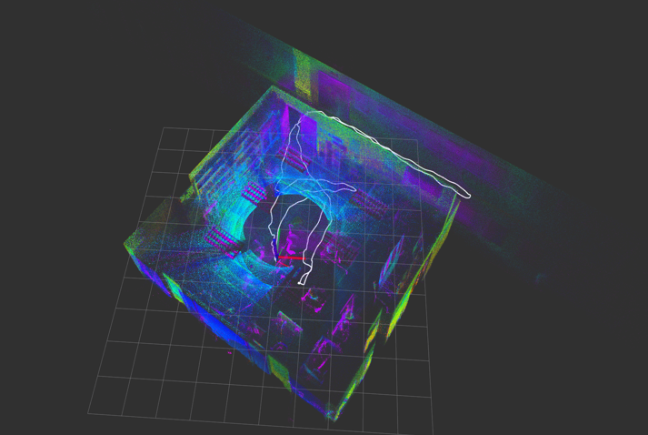
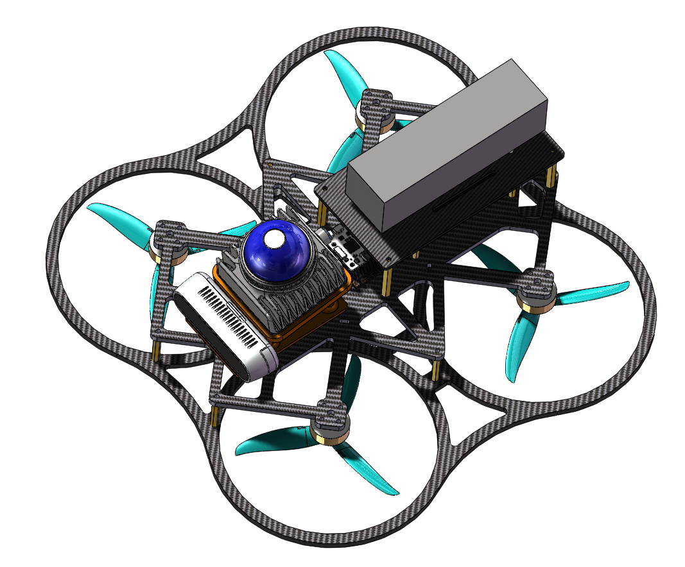
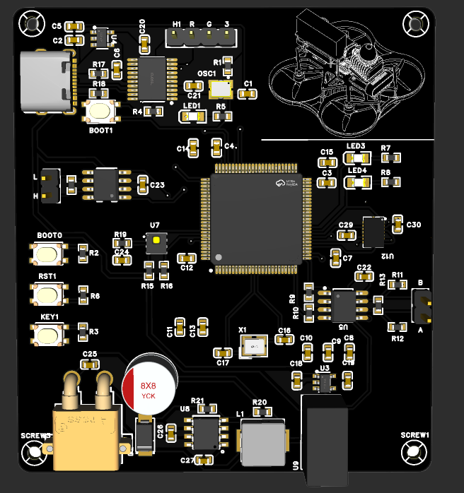
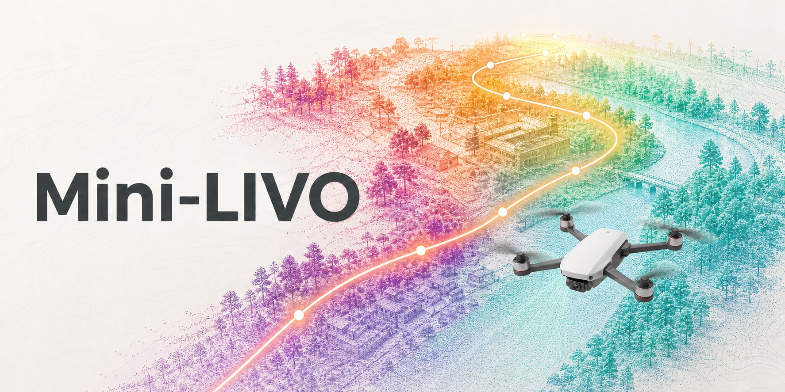
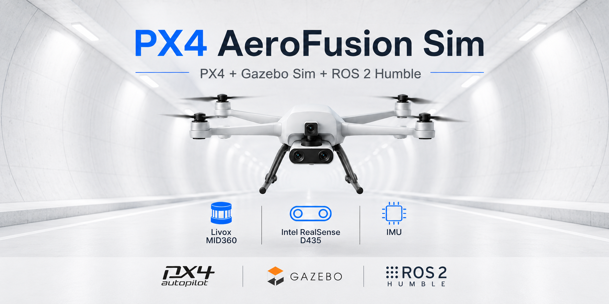
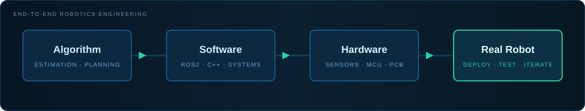

<!--
  GitHub Profile README — XinJie Zhang
-->

  <strong>English</strong>
  &nbsp;·&nbsp;
  <a href="./README.zh-CN.md">简体中文</a>

  

   

  <h1>Xinjie Zhang</h1>
  <h3>Mechanical Engineering</h3>

  

    <code>SLAM</code>&nbsp;&nbsp;·&nbsp;&nbsp;
    <code>UAV Autonomous Systems</code>&nbsp;&nbsp;·&nbsp;&nbsp;
    <code>Embedded Systems</code>
  

  
<strong>Building robotic systems from algorithms to real-world deployment.</strong>

  

    Algorithm Development&nbsp;&nbsp;·&nbsp;&nbsp;Software Architecture&nbsp;&nbsp;·&nbsp;&nbsp;
    Simulation&nbsp;&nbsp;·&nbsp;&nbsp;Hardware Integration&nbsp;&nbsp;·&nbsp;&nbsp;Field Deployment
  

 

## Core Expertise

<table>
  <tr>
    <td width="33.33%" valign="top">
      

        
      

      <h2>🛰️ SLAM</h2>
      
<strong>A LiDAR-Inertial-Visual SLAM framework</strong>

      
Autonomy Multi-Sensor Fusion System

      <ul>
        <li>LiDAR-Inertial Odometry</li>
        <li>Iterated Error State Kalman Filter</li>
        <li>Incremental Mapping</li>
        <li>Stereo Vision Fusion</li>
        <li>Sensor Calibration</li>
      </ul>
      

        <code>ROS2 Humble</code> <code>C++17</code> <code>Eigen</code> 
        <code>Sophus</code> <code>PCL</code> <code>Gazebo</code>
      

    </td>
    <td width="33.33%" valign="top">
      

        
      

      <h2>🚁 UAV</h2>
      
<strong>Autonomous Drone System</strong>

      
Autonomy Stack from Simulation to Flight

      <ul>
        <li>PX4 Integration</li>
        <li>UAV Hardware Platform</li>
        <li>ROS2 Communication</li>
        <li>Simulation Testing</li>
        <li>Real Flight Deployment</li>
      </ul>
      

        <code>PX4</code> <code>Gazebo</code> <code>ROS2</code> 
        <code>MAVLink</code> <code>Sensor Fusion</code>
      

    </td>
    <td width="33.33%" valign="top">
      

        
      

      <h2>🔧 Embedded</h2>
      
<strong>Embedded Robotics Hardware</strong>

      
Reliable Electronics for Robotic Platforms

      <ul>
        <li>STM32 Firmware</li>
        <li>PCB Design</li>
        <li>Sensor Driver</li>
        <li>Communication Interface</li>
        <li>Hardware Debugging</li>
      </ul>
      

        <code>STM32</code> <code>CAN</code> <code>UART</code> 
        <code>SPI</code> <code>I2C</code> <code>PCB</code>
      

    </td>
  </tr>
</table>

 

## Featured Engineering Projects

<table>
  <tr>
    <td width="50%" valign="top">
      
      <h3>
        <a href="https://github.com/legededaduzi/mini-livo">🔥 Mini-LIO ↗</a>
      </h3>
      
A lightweight LiDAR-Inertial Odometry framework based on ROS2.

      

        <strong>Real-time SLAM</strong> · IESKF Backend 
        ikd-Tree Incremental Mapping · MID360 Support 
        D435 Stereo Vision · UAV Deployment
      

      
<a href="https://github.com/legededaduzi/mini-livo"><strong>Explore the system →</strong></a>

    </td>
    <td width="50%" valign="top">
      
      <h3>
        <a href="https://github.com/legededaduzi/PX4-AeroFusion-Sim">🌎 ROS2–Gazebo Robotics Simulation</a>
      </h3>
      
A complete robotics simulation environment for autonomy validation.

      

        <strong>PX4 UAV Simulation</strong> · Livox MID360 Model 
        RealSense D435 Model · Indoor / Tunnel Environment 
        Reproducible SLAM Evaluation
      

      
<a href="https://github.com/legededaduzi/PX4-AeroFusion-Sim"><strong>Explore the platform →</strong></a>

    </td>
  </tr>
</table>

 

## Technology Stack

<table>
  <tr>
    <td width="25%" valign="top">
      <h4>ROBOTICS</h4>
      <code>ROS2</code>  
      <code>SLAM</code> <code>LIO</code>  
      <code>VIO</code> <code>Gazebo</code>
    </td>
    <td width="25%" valign="top">
      <h4>PROGRAMMING</h4>
      <code>C++17</code>  
      <code>Python</code>  
      <code>Eigen</code> <code>PCL</code>
    </td>
    <td width="25%" valign="top">
      <h4>EMBEDDED</h4>
      <code>STM32</code>  
      <code>CAN</code> <code>UART</code>  
      <code>SPI</code> <code>I2C</code>
    </td>
    <td width="25%" valign="top">
      <h4>HARDWARE</h4>
      <code>PCB</code>  
      <code>Sensors</code> <code>UAV</code>  
      <code>Debugging</code>
    </td>
  </tr>
</table>

 

## Engineering Philosophy

  

  <strong>From mathematical models and production software to integrated hardware and real-world robots.</strong>

 

  Open to opportunities in SLAM, robotics perception, autonomous UAV systems, and robotics engineering.
    
  <a href="https://github.com/legededaduzi">GitHub</a>

