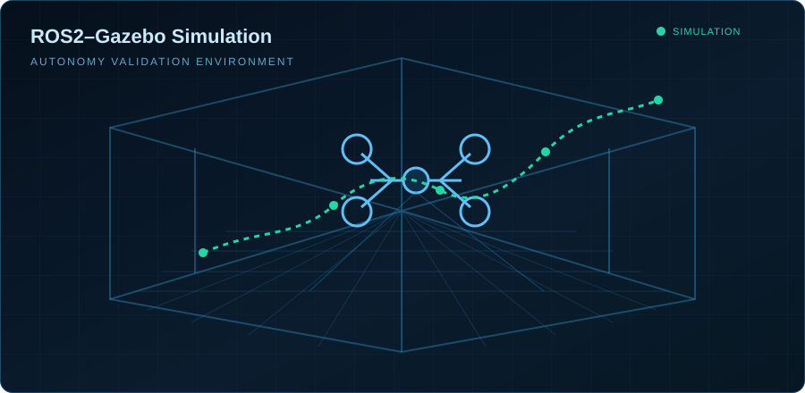

<!-- GitHub 个人主页 README — XinJie Zhang -->

  <a href="./README.md">English</a>
  &nbsp;·&nbsp;
  <strong>简体中文</strong>

  

   

  <h1>张心杰</h1>
  <h3>机械工程专业</h3>

  

    <code>SLAM</code>&nbsp;&nbsp;·&nbsp;&nbsp;
    <code>无人机自主系统</code>&nbsp;&nbsp;·&nbsp;&nbsp;
    <code>嵌入式系统</code>
  

  
<strong>构建从算法研究到真实环境部署的完整机器人系统。</strong>

  

    算法开发&nbsp;&nbsp;·&nbsp;&nbsp;软件架构&nbsp;&nbsp;·&nbsp;&nbsp;
    仿真模拟&nbsp;&nbsp;·&nbsp;&nbsp;硬件集成&nbsp;&nbsp;·&nbsp;&nbsp;实机部署
  

 

## 核心能力

<table>
  <tr>
    <td width="33.33%" valign="top">
      

        
      

      <h2>🛰️ SLAM</h2>
      

        <a href="https://github.com/legededaduzi/mini-livo">
          <strong>mini-LIVO ↗</strong>
        </a>
      

      
轻量级激光雷达—惯性—视觉 SLAM 框架

      <ul>
        <li>激光雷达—惯性里程计</li>
        <li>迭代误差状态卡尔曼滤波</li>
        <li> 增量式建图</li>
        <li>双目视觉融合</li>
        <li>多传感器标定</li>
      </ul>
      

        <code>ROS2 Humble</code> <code>C++17</code> <code>Eigen</code> 
        <code>Sophus</code> <code>PCL</code> <code>Gazebo</code>
      

    </td>
    <td width="33.33%" valign="top">
      

        
      

      <h2>🚁 无人机</h2>
      
<strong>自主无人机系统</strong>

      
从仿真测试到真实飞行的自主系统

      <ul>
        <li>PX4 系统集成</li>
        <li>无人机硬件平台</li>
        <li>ROS2 通信</li>
        <li>仿真测试</li>
        <li>真实飞行部署</li>
      </ul>
      

        <code>PX4</code> <code>Gazebo</code> <code>ROS2</code> 
        <code>MAVLink</code> <code>Sensor Fusion</code>
      

    </td>
    <td width="33.33%" valign="top">
      

        
      

      <h2>🔧 嵌入式</h2>
      
<strong>机器人嵌入式硬件</strong>

      
面向机器人平台的可靠电子系统

      <ul>
        <li>STM32 固件开发</li>
        <li>PCB 设计</li>
        <li>传感器驱动</li>
        <li>通信接口</li>
        <li>硬件调试</li>
      </ul>
      

        <code>STM32</code> <code>CAN</code> <code>UART</code> 
        <code>SPI</code> <code>I2C</code> <code>PCB</code>
      

    </td>
  </tr>
</table>

 

## 精选工程项目

<table>
  <tr>
    <td width="50%" valign="top">
      
      <h3>
        <a href="https://github.com/legededaduzi/mini-livo">🔥 Mini-LIO ↗</a>
      </h3>
      
基于 ROS2 的轻量级激光雷达—惯性里程计框架。

      

        <strong>实时 SLAM</strong> · IESKF 后端 
        ikd-Tree 增量建图 · MID360 支持 
        D435 双目视觉 · 无人机部署
      

      
<a href="https://github.com/legededaduzi/mini-livo"><strong>查看系统 →</strong></a>

    </td>
    <td width="50%" valign="top">
      
      <h3>🌎 ROS2–Gazebo 机器人仿真</h3>
      
面向自主系统验证的完整机器人仿真环境。

      

        <strong>PX4 无人机仿真</strong> · Livox MID360 模型 
        RealSense D435 模型 · 室内 / 隧道环境 
        可复现的 SLAM 评估
      

      
<a href="https://github.com/legededaduzi/mini-lio-sim"><strong>查看仿真平台 →</strong></a>

    </td>
  </tr>
</table>

 

## 技术栈

<table>
  <tr>
    <td width="25%" valign="top">
      <h4>机器人</h4>
      <code>ROS2</code>  
      <code>SLAM</code> <code>LIO</code>  
      <code>VIO</code> <code>Gazebo</code>
    </td>
    <td width="25%" valign="top">
      <h4>编程</h4>
      <code>C++17</code>  
      <code>Python</code>  
      <code>Eigen</code> <code>PCL</code>
    </td>
    <td width="25%" valign="top">
      <h4>嵌入式</h4>
      <code>STM32</code>  
      <code>CAN</code> <code>UART</code>  
      <code>SPI</code> <code>I2C</code>
    </td>
    <td width="25%" valign="top">
      <h4>硬件</h4>
      <code>PCB</code>  
      <code>传感器</code> <code>无人机</code>  
      <code>硬件调试</code>
    </td>
  </tr>
</table>

 

## 工程理念

  

  <strong>从数学模型和工程软件，到硬件集成与真实机器人部署。</strong>

 

  期待 SLAM、机器人感知、无人机自主系统与机器人工程方向的合作机会。
    
  <a href="https://github.com/legededaduzi">GitHub</a>

